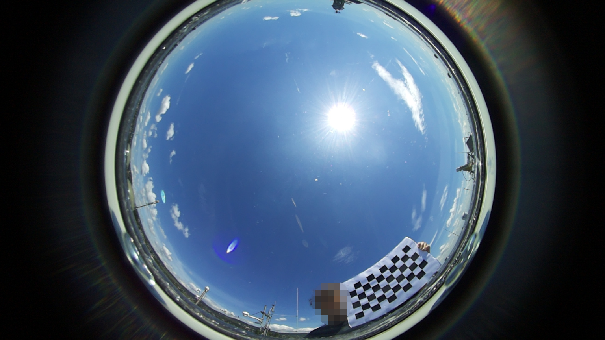
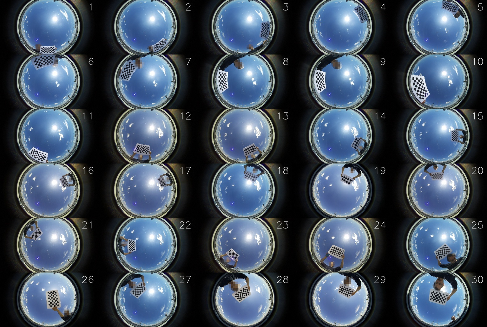
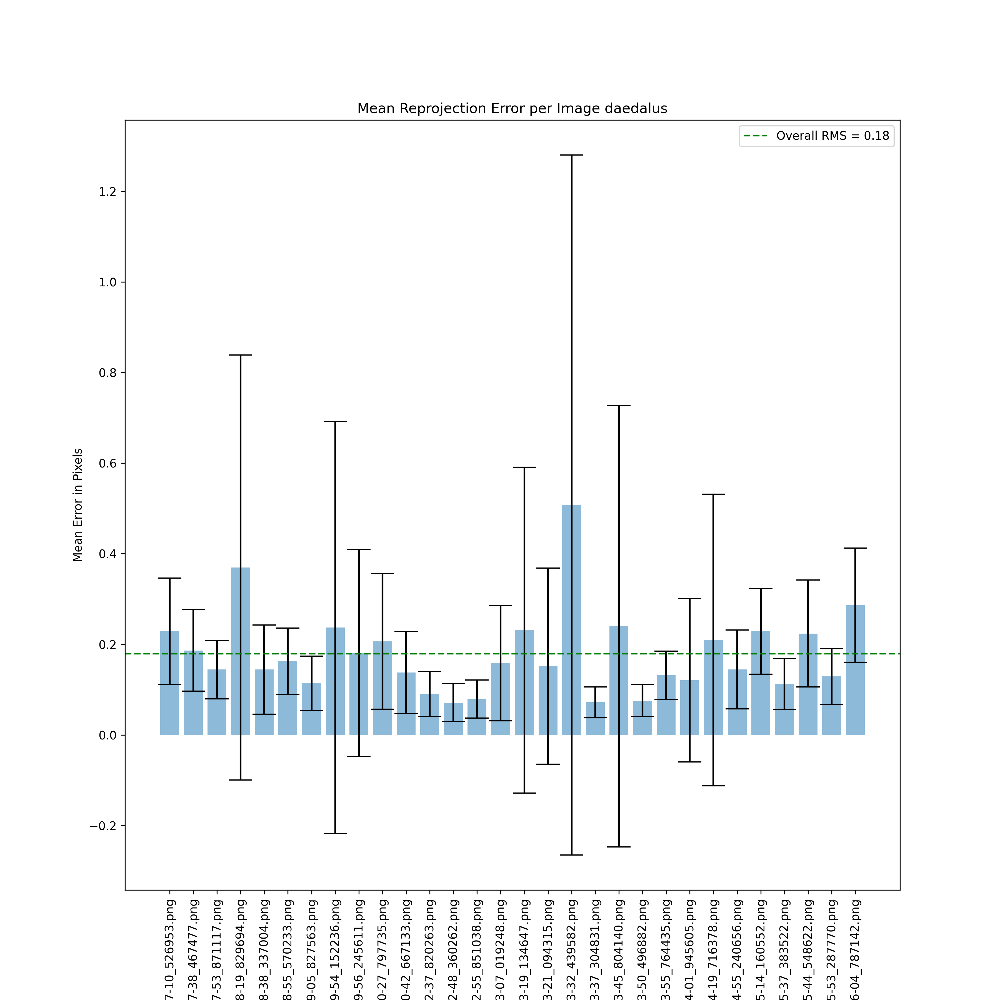
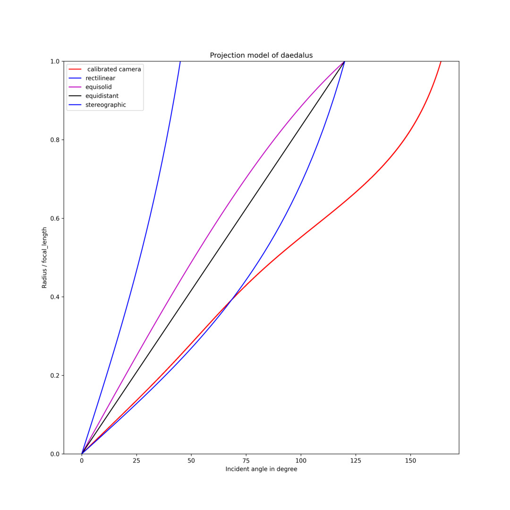
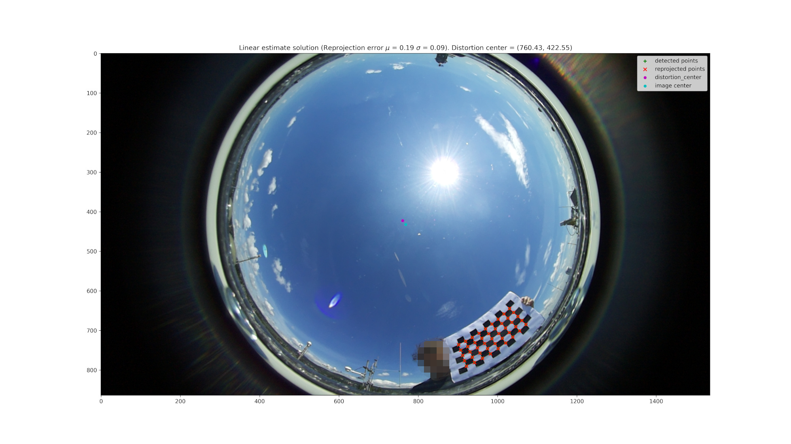

# Py-OCamCalib Calibration Guide (for Windows)

This guide walks you through the complete process of calibrating a fisheye or omnidirectional camera on Windows, from initial setup to analyzing calibration results.

## Table of Contents

1. [Prerequisites](#prerequisites)
2. [Step 1: Install Python](#step-1-install-python)
3. [Step 2: Clone the Repository](#step-2-clone-the-repository)
4. [Step 3: Set Up the Project](#step-3-set-up-the-project)
5. [Step 4: Prepare Calibration Images](#step-4-prepare-calibration-images)
6. [Step 5: Run Calibration](#step-5-run-calibration)
7. [Step 6: Analyze Results](#step-6-analyze-results)
8. [Troubleshooting](#troubleshooting)

---

## Prerequisites

- Windows 10 or Windows 11
- Administrator access (for installing Python)
- A set of images of a chessboard pattern taken with your fisheye camera (see Step 4 for examples)

---

## Step 1: Install Python

Py-OCamCalib requires **Python 3.13 or later**.

1. Go to [python.org/downloads](https://www.python.org/downloads/)
2. Download the latest Python 3.13+ installer for Windows
3. Run the installer
4. **Important**: Check the box **"Add Python to PATH"** before clicking "Install Now"
5. Verify installation by opening Command Prompt or PowerShell and typing:

```powershell
python --version
```

You should see something like: `Python 3.13.5`

---

## Step 2: Clone the Repository

1. Open PowerShell or Command Prompt
2. Navigate to where you want to store the project:

```powershell
cd C:\Users\YourUsername\Projects
```

3. Clone the repository:

```powershell
git clone https://github.com/jakarto3d/py-OCamCalib.git
cd py-OCamCalib
```

**Note**: If you don't have Git installed, you can download it from [git-scm.com](https://git-scm.com/download/win) or download the repository as a ZIP file and extract it.

---

## Step 3: Set Up the Py-OCamCalib

1. Open PowerShell in the project directory

2. Create a virtual environment:

```powershell
python -m venv .venv
```

3. Activate the virtual environment:

```powershell
.venv\Scripts\Activate.ps1
```

**Note**: If you get an execution policy error, run:
```powershell
Set-ExecutionPolicy -ExecutionPolicy RemoteSigned -Scope CurrentUser
```

You should see `(.venv)` at the beginning of your command prompt.

4. Upgrade pip:

```powershell
python -m pip install --upgrade pip
```

5. Install dependencies from requirements.txt:

```powershell
pip install -r requirements.txt
```

This will install all packages required for Py-OCamCalib.

6. Install Py-OCamCalib in editable mode:

```powershell
pip install -e .
```

7. Verify the installation:

```powershell
python -c "import pyocamcalib; print('Py-OCamCalib is ready!')"
```

You should see: `Py-OCamCalib is ready!`

---

## Step 4: Prepare Calibration Images

### 4.1 Ensure you have good calibration images

Take 20-30 photos of the chessboard with your fisheye camera:

**Tips for good calibration images:**

- Use a chessboard pattern with e.g. 10x6 squares (9x5 inner corners).
  
  The exact number is not relevant, but make sure that you have a short side with N and the lon side with at least N+3 squares. This ensures that the automatic corner detection can find the orientation of the chessboard, because the long side has more corners than what can fit on the short side.
- Take images from various angles.
  
  Try to take images that together cover the entire field of view of the camera. But do not try to cover a large area with a single image, because the automatic detection of the corners is more likely to fail if the chessboard is strongly distorted and more images give more calibration points for the optimization.
- Do not obstruct the chessboard with your hand or other objects.
- Hold steady and ensure the chessboard is in focus.

**Example of good calibration images:**





*Figure: Example calibration images*

### 4.3 Organize Images

1. Create a folder for your calibration images:

```powershell
mkdir C:\Users\YourUsername\calibration-images
```

2. Copy all your calibration images to this folder
3. Ensure images are in a supported format: `.jpg`, `.jpeg`, `.png`, `.bmp`, `.tiff`

---

## Step 5: Run Calibration

### 5.1 Basic Calibration Command

1. Make sure the virtual environment is activated:

```powershell
.venv\Scripts\Activate.ps1
```

You should see `(.venv)` at the beginning of your command prompt.

2. Run the calibration:

```powershell
python -m pyocamcalib.script.calibration_script `
  C:\Users\YourUsername\calibration-images `
  9 5 `
  --camera-name my-camera `
  --square-size 35
```

**Parameters explained:**
- `C:\Users\YourUsername\calibration-images` - Path to your images folder
- `9 5` - Number of **inner corners** (9 columns, 5 rows) when the pattern has 10x6 squares
- `--camera-name my-camera` - Name for your camera (used in output files)
- `--square-size 35` - Size of one chessboard square in **millimeters**

### 5.2 Expected Output

You should see output similar to this:

```
2026-04-22 13:15:38.103 | INFO     | pyocamcalib.modelling.calibration:detect_corners:78 - Start corners extraction
100%|██████████| 30/30 [00:04<00:00,  7.32it/s]
2026-04-22 13:15:42.810 | INFO     | pyocamcalib.modelling.calibration:detect_corners:140 - Extracted chessboard corners with success = 30/30
2026-04-22 13:15:42.810 | INFO     | pyocamcalib.modelling.calibration:save_detection:146 - Detection file saved with success.
⢿ INFO:: Start first linear estimation ...  ⡿
2026-04-22 13:16:05.628 | INFO     | pyocamcalib.modelling.calibration:estimate_fisheye_parameters:180 - Linear estimation end with success 
Linear RMS = 0.30 
Distortion Center = (760.41, 422.72)
Taylor_coefficient = [273.69, 0, -0.00162, 4.15e-06, -8.22e-09]
⢿ INFO:: Start bundle adjustment  ...  ⡿
2026-04-22 13:18:08.581 | INFO     | pyocamcalib.modelling.calibration:estimate_fisheye_parameters:208 - Bundle Adjustment end with success 
Optimize rms = 0.18 
Distortion Center = (760.43, 422.55)
Taylor_coefficient = [2.74e+02, 0.0, -1.61e-03, 4.16e-06, -8.24e-09]
2026-04-22 13:18:08.590 | INFO     | pyocamcalib.modelling.calibration:find_poly_inv:544 - Poly fit end with success.
2026-04-22 13:18:08.590 | INFO     | pyocamcalib.modelling.calibration:find_poly_inv:545 - Reprojection Error : 0.0090
```

**Success indicators:**
- `Extracted chessboard corners with success = 30/30` - All images detected
- `Optimize rms = 0.18` - Low reprojection error (< 0.5 is good)
- `Reprojection Error : 0.0090` - Inverse polynomial fitted successfully

### 5.3 Output Files

After calibration, you'll find results in the `output\my-camera\` folder:

```
output\my-camera\
├── calibration\
│   └── calibration_my-camera.json    # Calibration parameters
├── corners_detection\
│   └── corner_detections_my-camera.pickle
├── reprojections\
│   └── reprojection_*.png             # Per-image reprojection overlays
├── Mean_reprojection_error_my-camera.png
└── Model_projection_my-camera.png
```

---

## Step 6: Analyze Results

### 6.1 Reprojection Error Plot

Open `Mean_reprojection_error_my-camera.png` to see the reprojection error for each image:



*Figure: Mean reprojection error per image. Lower is better. The green dashed line shows the overall RMS error.*

**What to look for:**
- **Overall RMS** (green line): Should be < 1 pixel for good calibration
- **Individual bars**: Should be relatively uniform; outliers may indicate problematic images
- **Error bars**: Show standard deviation; smaller is better

### 6.2 Model Projection Plot

Open `Model_projection_my-camera.png` to see how your camera's projection compares to ideal models:



*Figure: Projection model comparison. The red curve shows your calibrated camera's response.*

**What to look for:**
- The red curve should be smooth and monotonic
- Comparison with canonical models (rectilinear, equidistant, etc.) shows your lens characteristics

### 6.3 Reprojection Overlays

Open any image in `reprojections\` to see detected vs. reprojected corners:



*Figure: Reprojection overlay. Green crosses = detected corners, Red x's = reprojected corners.*

**What to look for:**
- Green and red markers should align closely
- Systematic misalignment may indicate calibration issues

### 6.4 Calibration Parameters

Open `calibration\calibration_my-camera.json` to see the numerical parameters:

```json
{
  "camera_name": "my-camera",
  "taylor_coefficient": [273.67, 0.0, -0.00161, 4.16e-06, -8.24e-09],
  "distortion_center": [760.43, 422.55],
  "stretch_matrix": [[1.001, 0.001], [0.001, 1.0]],
  "rms_overall": 0.179,
  ...
}
```

**Key parameters:**
- `taylor_coefficient`: Polynomial mapping function coefficients
- `distortion_center`: Optical center in pixels
- `stretch_matrix`: Sensor-to-lens alignment compensation
- `rms_overall`: Overall reprojection error (pixels)

---

## Troubleshooting

### Common Issues

#### 1. "Extracted chessboard corners with success = 0/30"

**Cause**: chessboard not detected in any images.

**Solutions:**

- Verify you set the chessboard's **inner** corners (e.g., 9x5), not the number of squares
- Ensure images are sharp and well-lit
- Use `--check` flag for manual correction of corner detections
- Check that images are in supported formats (.jpg, .png, etc.)

#### 2. "Linear estimation failed"

**Cause**: Insufficient or poor-quality detections.

**Solutions:**

- Use more images (at least 15-20)
- Ensure images of the chessboard cover the entire field of view
- Include images with various tilts and angles
- Remove blurry or poorly lit images

#### 3. High reprojection error (> 1.0 pixels)

**Cause**: Poor calibration quality.

**Solutions:**

- Check for outlier images in the reprojection error plot
- Remove images with high individual error
- Recalibrate with more diverse viewpoints

#### 4. "ModuleNotFoundError: No module named 'pyocamcalib'"

**Cause**: Virtual environment not activated or package not installed.

**Solution:**
```powershell
cd C:\path\to\py-OCamCalib
.venv\Scripts\Activate.ps1
pip install -e .
python -m pyocamcalib.script.calibration_script ...
```

#### 5. PowerShell execution policy error

**Cause**: PowerShell script execution is restricted.

**Solution:**
```powershell
Set-ExecutionPolicy -ExecutionPolicy RemoteSigned -Scope CurrentUser
```

#### 6. "No module named 'requirements'"

**Cause**: Typo in pip install command.

**Solution:**
```powershell
pip install -r requirements.txt
```

Make sure to include the `-r` flag and the `.txt` extension.
