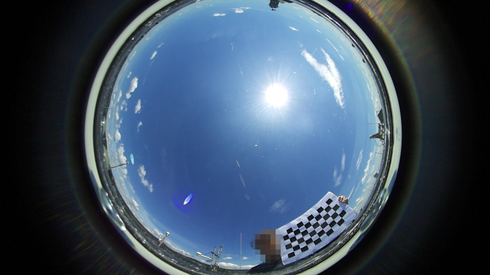
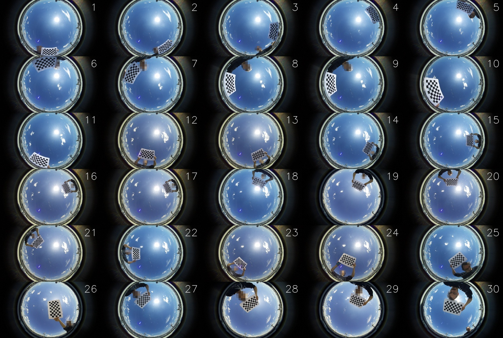
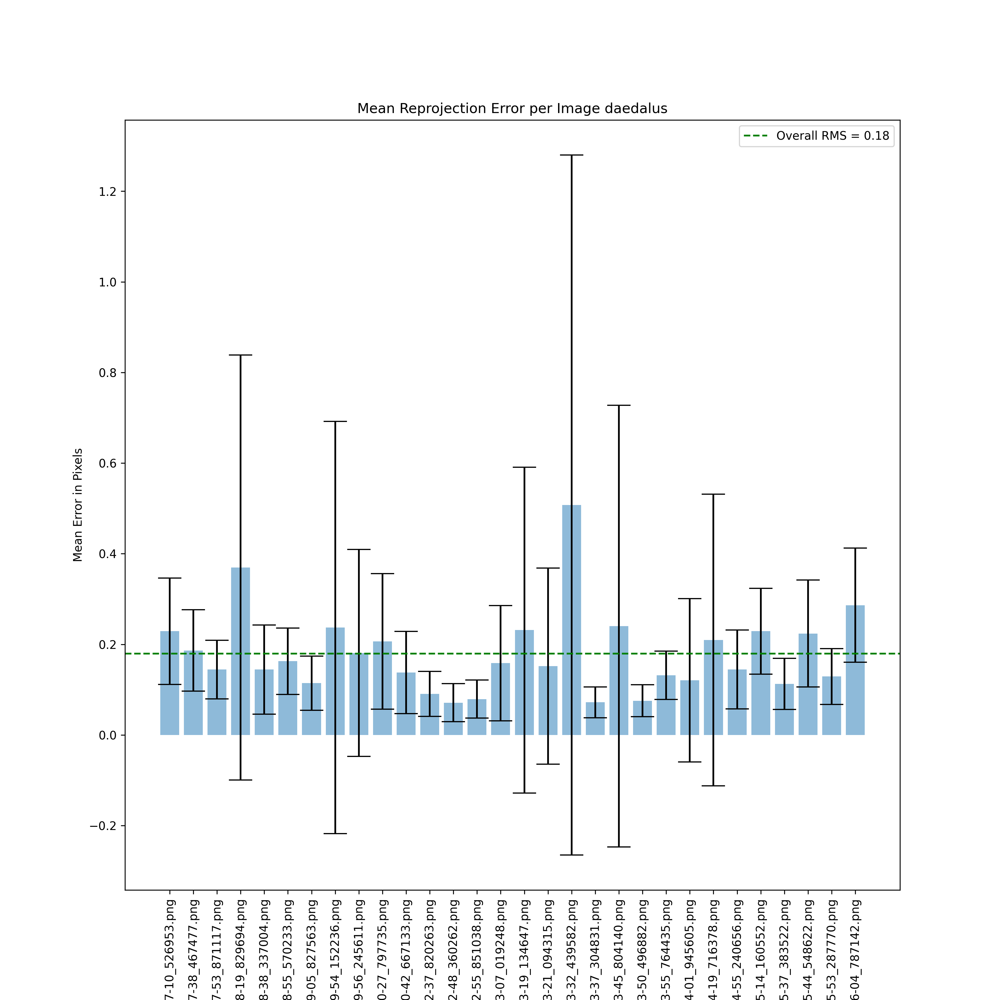
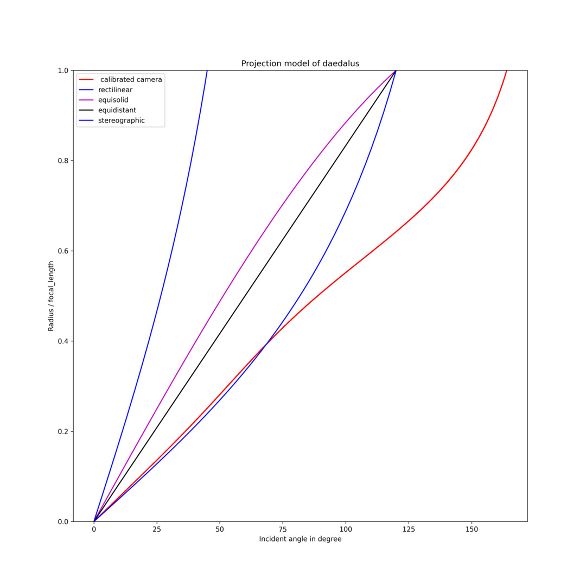
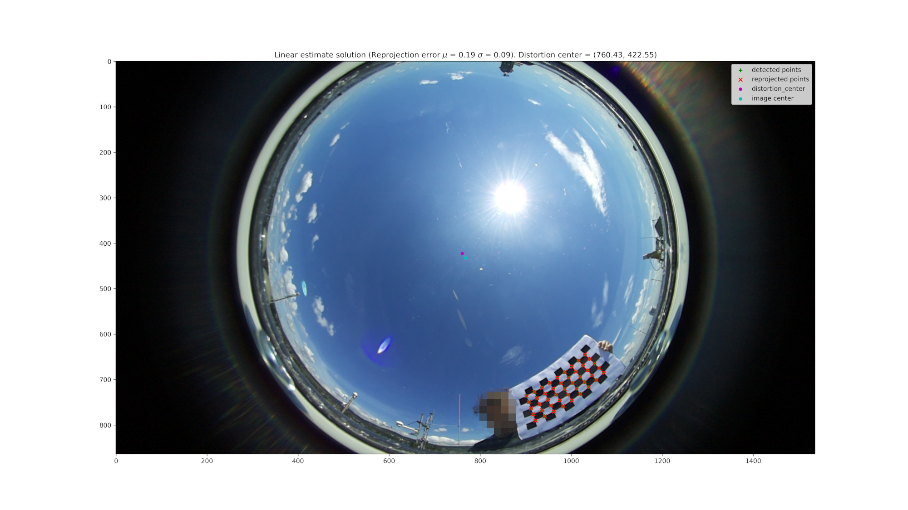
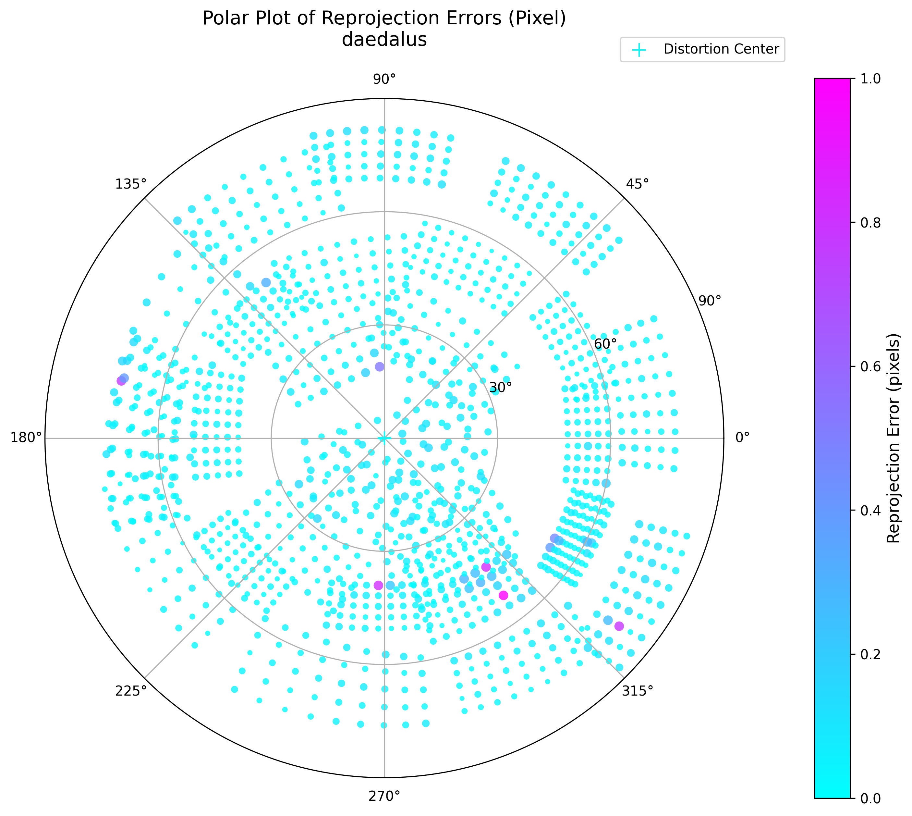
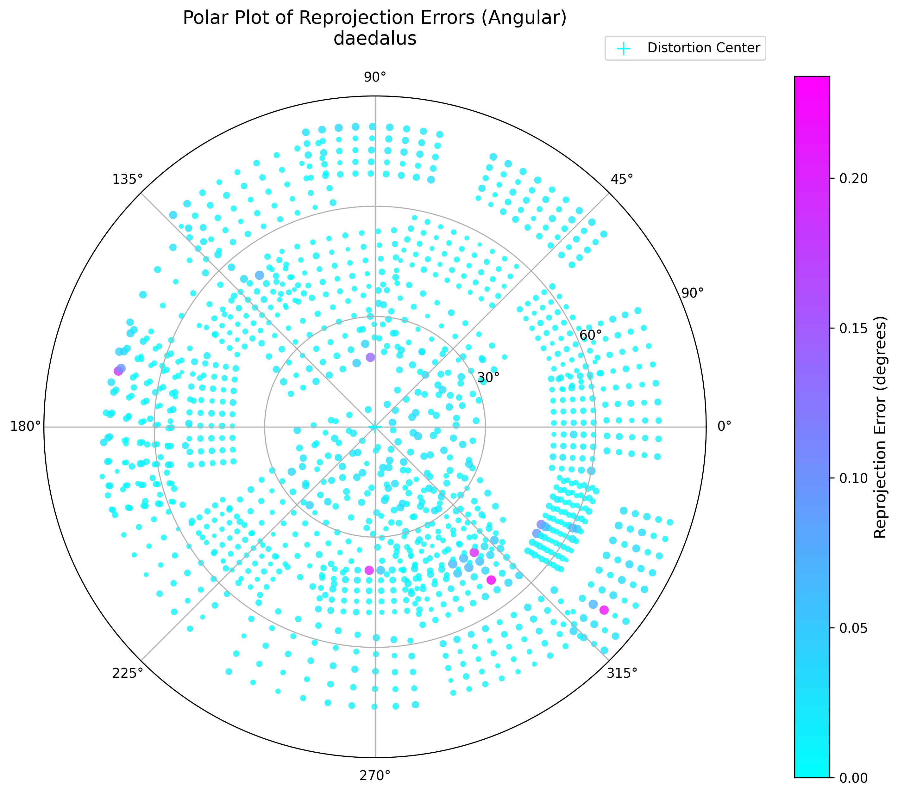

# Py-OCamCalib Calibration Guide

This guide walks you through the complete process of calibrating a fisheye or omnidirectional camera, from initial setup to analyzing calibration results. It works on both Linux and Windows.

## Table of Contents

1. [Prerequisites](#prerequisites)
2. [Step 1: Clone the Repository](#step-1-clone-the-repository)
3. [Step 2: Set Up the Project](#step-2-set-up-the-project)
4. [Step 3: Prepare Calibration Images](#step-3-prepare-calibration-images)
5. [Step 4: Run Calibration](#step-4-run-calibration)
6. [Step 5: Analyze Results](#step-5-analyze-results)

---

## Prerequisites

- **Python 3.13 or later** installed and on your `PATH`.
- **uv** installed. See the official [uv installation guide](https://docs.astral.sh/uv/getting-started/installation/).
- **Git** installed.
- A set of images of a chessboard pattern taken with your fisheye camera (see Step 3 for examples).

---

## Step 1: Clone the Repository

Open a terminal (Linux) or PowerShell (Windows), navigate to where you want to store the project, and clone it:

```bash
git clone https://github.com/jakarto3d/py-OCamCalib.git
cd py-OCamCalib
```

---

## Step 2: Set Up the Project

From the project directory, let uv create the virtual environment and install all dependencies (including Py-OCamCalib itself):

```bash
uv sync
```

That single command reads `pyproject.toml` and `uv.lock`, creates a `.venv`, and installs everything needed. You do not need to activate the environment manually — `uv run` (used in Step 4) does that for you.

---

## Step 3: Prepare Calibration Images

### 3.1 Ensure you have good calibration images

Take 20-30 photos of the chessboard with your fisheye camera:

**Tips for good calibration images:**

- Use a chessboard pattern with e.g. 10x6 squares (9x5 inner corners).

  The exact number is not relevant, but make sure that you have a short side with N and the long side with at least N+3 squares. This ensures that the automatic corner detection can find the orientation of the chessboard, because the long side has more corners than what can fit on the short side.
- Take images from various angles.

  Try to take images that together cover the entire field of view of the camera. But do not try to cover a large area with a single image, because the automatic detection of the corners is more likely to fail if the chessboard is strongly distorted and more images give more calibration points for the optimization.
- Do not obstruct the chessboard with your hand or other objects.
- Hold steady and ensure the chessboard is in focus.

**Example of good calibration images:**





*Figure: Example calibration images*

### 3.2 Organize Images

1. Put all your calibration images in a single folder.
2. Ensure images are in a supported format: `.jpg`, `.jpeg`, `.png`, `.bmp`, `.tiff`.

---

## Step 4: Run Calibration

### 4.1 Basic Calibration Command

Run the calibration script as a module with `uv run`. Replace the image folder path with your own.

**Linux / macOS:**

```bash
uv run python -m pyocamcalib.script.calibration_script \
  /path/to/calibration-images \
  9 5 \
  --camera-name my-camera \
  --square-size 35
```

**Windows (PowerShell):**

```powershell
uv run python -m pyocamcalib.script.calibration_script `
  C:\Users\YourUsername\calibration-images `
  9 5 `
  --camera-name my-camera `
  --square-size 35
```

**Parameters explained:**
- `.../calibration-images` - Path to your images folder
- `9 5` - Number of **inner corners** (9 columns, 5 rows) when the pattern has 10x6 squares
- `--camera-name my-camera` - Name for your camera (used in output files)
- `--square-size 35` - Size of one chessboard square in **millimeters**

### 4.2 Expected Output

You should see output similar to this:

```
2026-04-22 13:15:38.103 | INFO     | pyocamcalib.modelling.calibration:detect_corners:78 - Start corners extraction
100%|██████████| 30/30 [00:04<00:00,  7.32it/s]
2026-04-22 13:15:42.810 | INFO     | pyocamcalib.modelling.calibration:detect_corners:140 - Extracted chessboard corners with success = 30/30
2026-04-22 13:15:42.810 | INFO     | pyocamcalib.modelling.calibration:save_detection:146 - Detection file saved with success.
⢿ INFO:: Start first linear estimation ...  ⡿
2026-04-22 13:16:05.628 | INFO     | pyocamcalib.modelling.calibration:estimate_fisheye_parameters:180 - Linear estimation end with success 
Linear RMS = 0.30 
Distortion Center = (760.41, 422.72)
Taylor_coefficient = [273.69, 0, -0.00162, 4.15e-06, -8.22e-09]
⢿ INFO:: Start bundle adjustment  ...  ⡿
2026-04-22 13:18:08.581 | INFO     | pyocamcalib.modelling.calibration:estimate_fisheye_parameters:208 - Bundle Adjustment end with success 
Optimize rms = 0.18 
Distortion Center = (760.43, 422.55)
Taylor_coefficient = [2.74e+02, 0.0, -1.61e-03, 4.16e-06, -8.24e-09]
2026-04-22 13:18:08.590 | INFO     | pyocamcalib.modelling.calibration:find_poly_inv:544 - Poly fit end with success.
2026-04-22 13:18:08.590 | INFO     | pyocamcalib.modelling.calibration:find_poly_inv:545 - Reprojection Error : 0.0090
```

The bundle adjustment step can take over a minute. That is normal.

**Success indicators:**
- `Extracted chessboard corners with success = 30/30` - All images detected
- `Optimize rms = 0.18` - Low reprojection error (< 0.5 is good)
- `Reprojection Error : 0.0090` - Inverse polynomial fitted successfully

### 4.3 Output Files

After calibration, you'll find results in the `output/my-camera/` folder:

```
output/my-camera/
├── calibration/
│   └── calibration_my-camera.json    # Calibration parameters
├── corners_detection/
│   └── corner_detections_my-camera.pickle
├── reprojections/
│   └── reprojection_*.png             # Per-image reprojection overlays
├── Mean_reprojection_error_my-camera.png
└── Model_projection_my-camera.png
```

---

## Step 5: Analyze Results

### 5.1 Reprojection Error Plot

Open `Mean_reprojection_error_my-camera.png` to see the reprojection error for each image:



*Figure: Mean reprojection error per image. Lower is better. The green dashed line shows the overall RMS error.*

**What to look for:**
- **Overall RMS** (green line): Should be < 1 pixel for good calibration
- **Individual bars**: Should be relatively uniform; outliers may indicate problematic images
- **Error bars**: Show standard deviation; smaller is better

### 5.2 Model Projection Plot

Open `Model_projection_my-camera.png` to see how your camera's projection compares to ideal models:



*Figure: Projection model comparison. The red curve shows your calibrated camera's response.*

**What to look for:**
- The red curve should be smooth and monotonic
- Comparison with canonical models (rectilinear, equidistant, etc.) shows your lens characteristics

### 5.3 Reprojection Overlays

Open any image in `reprojections/` to see detected vs. reprojected corners:



*Figure: Reprojection overlay. Green crosses = detected corners, Red x's = reprojected corners.*

**What to look for:**
- Green and red markers should align closely
- Systematic misalignment may indicate calibration issues

### 5.4 Polar Error Plots

The polar error plots show every reprojected corner placed by its viewing angle: the radius is the incidence angle from the optical axis (center = straight ahead, outer ring = edge of the field of view) and the angle is the azimuth around the axis. Color and size encode the reprojection error, so you can see where in the lens's field of view the model fits well and where it does not.

Two versions are produced: error in pixels and error in degrees (the angular error, computed from the derivative of the projection model):



*Figure: Reprojection error in pixels, plotted in polar coordinates.*



*Figure: Reprojection error in degrees.*

**What to look for:**
- Errors should be small (cyan) and spread evenly across the field of view.
- Clusters of large errors (magenta) at a particular radius or azimuth point to a region where the model fits poorly.
- Good angular coverage of points out to the outer ring means your images sampled the full field of view.

### 5.5 Calibration Parameters

Open `calibration/calibration_my-camera.json` to see the numerical parameters:

```json
{
  "camera_name": "my-camera",
  "taylor_coefficient": [273.67, 0.0, -0.00161, 4.16e-06, -8.24e-09],
  "distortion_center": [760.43, 422.55],
  "stretch_matrix": [[1.001, 0.001], [0.001, 1.0]],
  "rms_overall": 0.179,
  ...
}
```

**Key parameters:**
- `taylor_coefficient`: Polynomial mapping function coefficients
- `distortion_center`: Optical center in pixels
- `stretch_matrix`: Sensor-to-lens alignment compensation
- `rms_overall`: Overall reprojection error (pixels)
